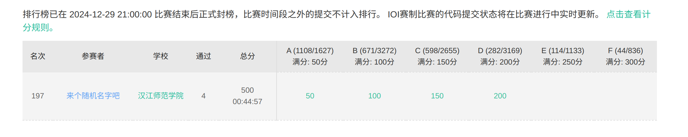

### 牛客周赛74
比赛链接: https://ac.nowcoder.com/acm/contest/99458#question  
[赛时记录](https://www.bilibili.com/video/BV1AF6aYvEzN/?spm_id_from=333.999.0.0&vd_source=a7f65812d4c95fa7e01618957095a49f)  

这场打得有点菜（ ）。  



#### D
这次D好简单啊，但是需要注意的一点是，他是同时翻两张的牌的，不能是看见了一张牌，然后再翻下一张。  
然后就很简单了。
```c++
// Author: Zhangwuji
// Date: 2024-12-29
// Time: 19:34:07

// #define YUANSHEN
#if defined(YUANSHEN)
#include "/home/skadi/cp_code/templates/debug.hpp"
#else
#include <bits/stdc++.h>
using namespace std;
#define dbg(...) 42
#endif
template <typename T1, typename T2>
void cmin(T1& x, const T2& y)
{
    x = x < y ? x : y;
}
template <typename T1, typename T2>
void cmax(T1& x, const T2& y)
{
    x = x > y ? x : y;
}
using ll = long long;
using ull = unsigned long long;
using vi = vector<int>;
using vl = vector<ll>;
using pii = pair<int, int>;
using pll = pair<ll, ll>;
#define fixset(x) fixed << setprecision(x)
#define fi first
#define se second
#define sz(x) (int)(x).size()
#define all(x) (x).begin(), (x).end()
#define ALL(x) (x).begin() + 1, (x).end()
constexpr int INF = 1000000000;
constexpr ll LNF = 1000000000000000000LL;

void solve()
{
    int n;
    cin>>n;
    vi a(n+1);
    ll sum=-n;
    for(int i=1;i<=n;i++)
        cin>>a[i],sum+=a[i];
    if(n==1){
        cout<<"-1\n";
        return;
    }
    int mx=*max_element(ALL(a));
    if(mx==1){
        cout<<"0\n";
    }else{
        cout<<min(1ll*mx,sum)<<'\n';
    }
}

int main()
{
#ifndef YUANSHEN
    ios::sync_with_stdio(false);
    cin.tie(0);
    cout.tie(0);
#endif
    int T = 1;
    cin >> T;
    while (T--)
        solve();
    return 0;
}
//2 2
//2 2 1 
```

#### E
题目读错了一点啊，我以为是可以进行无限次操作。如果是只进行一次操作，会简单很多。但是，要注意数组里不能有重复的数字！！！因为题目里说了要严格递增/递减，hhh原来是这个意思。

``` C++
// Author: Zhangwuji
// Date: 2024-12-30
// Time: 15:31:33

// #define YUANSHEN
#if defined(YUANSHEN)
#include "/home/skadi/cp_code/template/debug.hpp"
#else
#include <bits/stdc++.h>
using namespace std;
#define dbg(...) 42
#endif
template <typename T1, typename T2>
void cmin(T1& x, const T2& y)
{
    x = x < y ? x : y;
}
template <typename T1, typename T2>
void cmax(T1& x, const T2& y)
{
    x = x > y ? x : y;
}
using ll = long long;
using ull = unsigned long long;
using vi = vector<int>;
using vl = vector<ll>;
using pii = pair<int, int>;
using pll = pair<ll, ll>;
#define fixset(x) fixed << setprecision(x)
#define fi first
#define se second
#define sz(x) (int)(x).size()
#define all(x) (x).begin(), (x).end()
#define ALL(x) (x).begin() + 1, (x).end()
constexpr int INF = 1000000000;
constexpr ll LNF = 1000000000000000000LL;

void solve()
{
    int n, m;
    cin >> n >> m;
    auto check = [&](vi& b) {
        multiset<int> st;
        vi pre(n + 1, 1);
        for (int i = 2; i <= n; i++) {
            if (b[i] > b[i - 1])
                pre[i] = pre[i - 1] + 1;
        }
        for (int i = m; i <= n; i++)
            st.insert(b[i]);
        for (int i = m; i <= n; i++) {
            st.erase(st.lower_bound(b[i]));
            if (pre[i] >= m) {
                auto i1 = st.lower_bound(b[i]);
                if (i1 == st.begin())
                    return true;
                auto i2 = prev(i1);
                if (*i2 <= b[i - m + 1])
                    return true;
            }
            st.insert(b[i - m + 1]);
        }
        return false;
    };
    vi a(n + 1);
    for (int i = 1; i <= n; i++)
        cin >> a[i];
    map<int, int> vis;
    for (int i = 1; i <= n; i++) {
        if (vis[a[i]]) {
            cout << "NO\n";
            return;
        }
        vis[a[i]] = 1;
    }
    if (check(a)) {
        cout << "YES\n";
        return;
    }
    reverse(ALL(a));
    if (check(a)) {
        cout << "YES\n";
        return;
    }
    cout << "NO\n";
}

int main()
{
#ifndef YUANSHEN
    ios::sync_with_stdio(false);
    cin.tie(0);
    cout.tie(0);
#endif
    int T = 1;
    cin >> T;
    while (T--)
        solve();
    return 0;
}
```

#### F
好像挺有难度的，不会写，现在看。。。  
这个dp很好啊，枚举每一个LCA，他的子结点作为两个端点，很好的题目，牛客周赛老喜欢出树形DP，确实挺不错的。  
$dp_{v,j}$ 表示以v为顶点的子树具有的状态为j的路径的数量。  
``` C++
// Author: Zhangwuji
// Date: 2024-12-29
// Time: 20:04:37

// #define YUANSHEN
#if defined(YUANSHEN)
#include "/home/skadi/cp_code/templates/debug.hpp"
#else
#include <bits/stdc++.h>
using namespace std;
#define dbg(...) 42
#endif
template <typename T1, typename T2>
void cmin(T1& x, const T2& y)
{
    x = x < y ? x : y;
}
template <typename T1, typename T2>
void cmax(T1& x, const T2& y)
{
    x = x > y ? x : y;
}
using ll = long long;
using ull = unsigned long long;
using vi = vector<int>;
using vl = vector<ll>;
using pii = pair<int, int>;
using pll = pair<ll, ll>;
#define fixset(x) fixed << setprecision(x)
#define fi first
#define se second
#define sz(x) (int)(x).size()
#define all(x) (x).begin(), (x).end()
#define ALL(x) (x).begin() + 1, (x).end()
constexpr int INF = 1000000000;
constexpr ll LNF = 1000000000000000000LL;

void solve()
{
    int n,a,b;
    cin>>n>>a>>b;
    vector<vi>g(n+1,vi());
    vi w(n+1);
    for(int i=1;i<=n;i++)
        cin>>w[i];
    for(int i=1;i<n;i++){
        int u,v;
        cin>>u>>v;
        g[u].push_back(v);
        g[v].push_back(u);
    }
    auto calc=[&](int x){
        int res=0;
        if(x<=a) res|=1;
        if(x>=b) res|=2;
        return res;
    };
    vector<vl>dp(n+1,vl(4));
    ll ans=0;
    auto dfs=[&](auto &&self,int u,int pre)->void{
        dp[u][calc(w[u])]=1;
        // cerr<<u<<" "<<pre<<'\n';
        for(auto &v:g[u]){
            if(v==pre) continue;
            self(self,v,u);
            for(int i=0;i<4;i++)
                for(int j=0;j<4;j++){
                    if((i|j)==3){
                        ans+=dp[u][i]*dp[v][j];
                        // cerr<<ans<<'\n';
                    }
                }
            for(int i=0;i<4;i++)
                dp[u][calc(w[u])|i]+=dp[v][i];
        }
    };
    dfs(dfs,1,0);
    cout<<ans<<'\n';
}

int main()
{
#ifndef YUANSHEN
    ios::sync_with_stdio(false);
    cin.tie(0);
    cout.tie(0);
#endif
    int T = 1;
    // cin >> T;
    while (T--)
        solve();
    return 0;
}
```